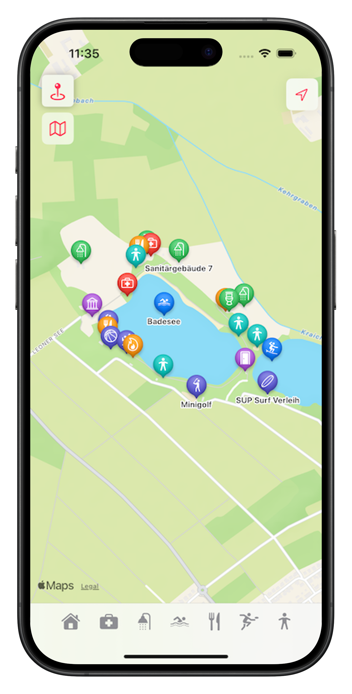
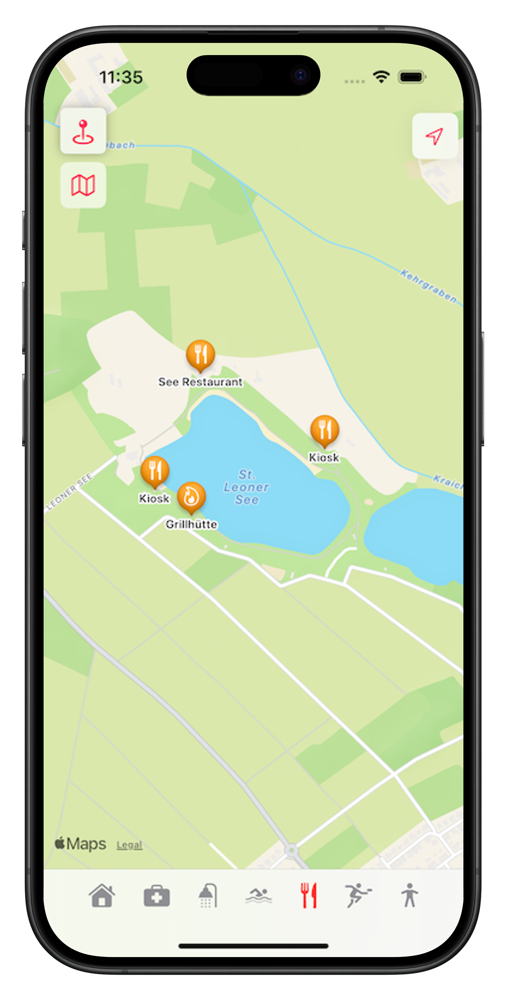
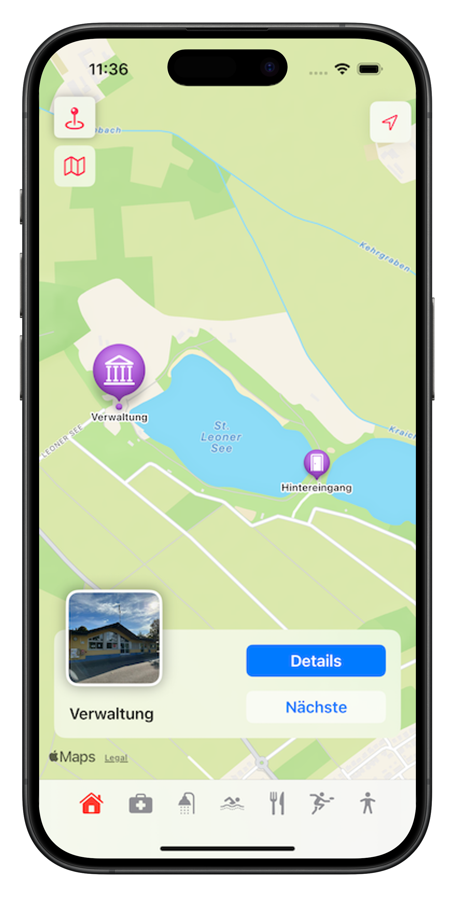
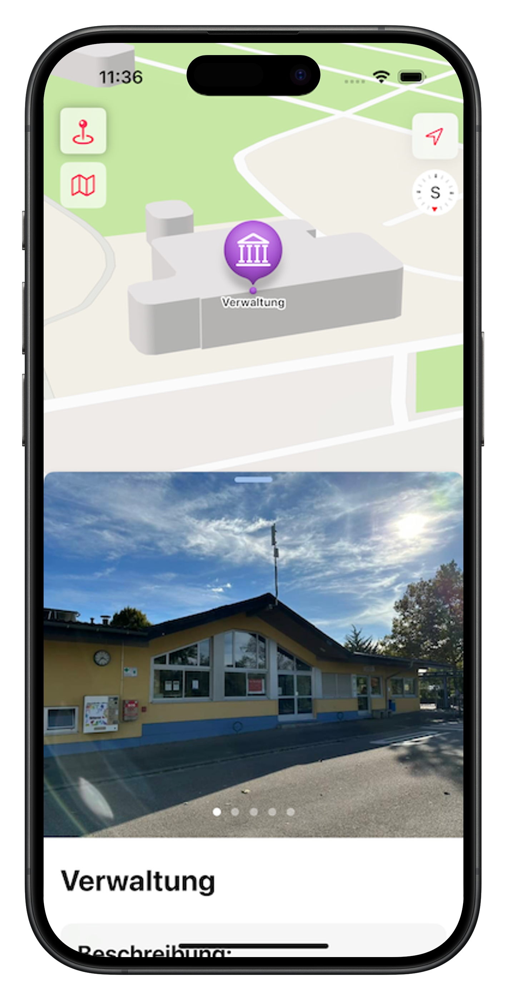
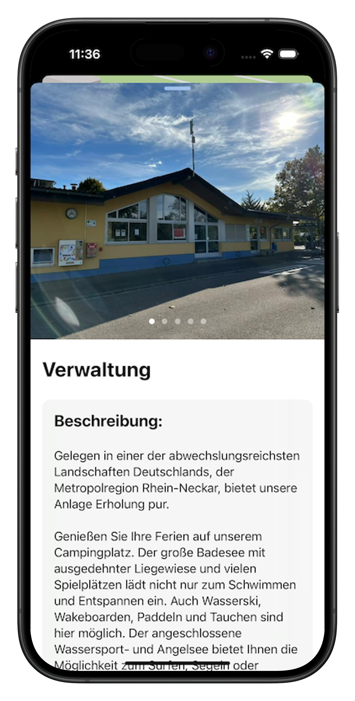

# 🗺️ See-Sights

**See-Sights** ist eine iOS-App, die Besuchern von Badeseen hilft, sich einfach und visuell auf dem Gelände zu orientieren. Die App nutzt MapKit in Kombination mit einer SwiftUI-basierten Benutzeroberfläche, um wichtige Orte wie Restaurants, Erste-Hilfe-Stationen oder Sanitäranlagen übersichtlich darzustellen.

---

## 🚀 Funktionen

- Vollständig native SwiftUI-App mit interaktiver **MapKit-Karte**
- Startansicht zeigt einen festgelegten Badesee in St. Leon-Rot
- Tap auf Marker öffnet ein **Sheet mit Beschreibung und Fotos** der Location
- Wichtige Kategorien wie:
  - Erste Hilfe
  - Gastronomie
  - Verwaltung
  - Sanitäranlagen
- **Tabbar-Filternavigation** für einfache Orientierung
- Lokale Datenhaltung – **kein Login, keine Cloudbindung**
- **Fallback-Karte als PDF**

---

## 🎯 Fokus

Der Fokus liegt auf einer **intuitiven Benutzerführung**, einer **modernen Kartendarstellung** mit SwiftUI & MapKit sowie einer **modularen Architektur**, die später auf weitere Seen oder Echtzeitdaten erweitert werden kann.

---

## 🌱 Zukünftige Erweiterungen

- API-Anbindung für Inhalte wie Speisekarten oder aktuelle Informationen  
- Unterstützung mehrerer Seen *(modulare Datenstruktur bereits vorhanden)*  
- Widget-Integration zur Anzeige wichtiger Informationen direkt auf dem Homescreen  
- Kostenlose Nutzung in der ersten Version

---

## 🛠️ Verwendete Technologien

- **Swift** & **SwiftUI**
- **MapKit** für Karten und Annotationen
- Lokale Datenstruktur *(kein Backend)*
- **Custom Sheets** mit Text und Bildern
- **Modulares Filtersystem** via Tabbar

---

## 📸 Screenshots

### 🗺️ Startansicht der Karte

### 🔍 Gefilterte Ansicht: Erste Auswahl

### 🔍 Gefilterte Ansicht: Zweite Auswahl

### 📍 Ausgewählter Ort auf der Karte

### ℹ️ Detailansicht (Medium Sheet)

### ℹ️ Detailansicht (Large Sheet)

---

## 🎥 Demo

Ein animiertes GIF zeigt die wichtigsten Interaktionen in der App:

- Navigation auf der Karte  
- Öffnen eines Standorts  
- Wechsel zwischen Kategorien *(via Tabbar)*

*Live-Demo ohne Geräte-Rahmen (Bezel)*

---

## 🎯 Motivation

Ich habe **See-Sights** entwickelt, um Besuchern eine einfache Möglichkeit zu bieten, sich an einem See zurechtzufinden – ohne auf gedruckte Pläne oder unübersichtliche Websites angewiesen zu sein. Die App ist bewusst modular und erweiterbar aufgebaut, um später weitere Seen, APIs oder Features (z. B. Gastronomie-Specials) zu integrieren.

Der Fokus liegt auf:

- Visuell klarer Kartendarstellung  
- Flexibler Architektur für zukünftige Inhalte und Features  
- Durchdachtem Benutzerfluss

---

## 📂 Hinweis zum Repository

> Dieses Repository dient aktuell nur der **Präsentation** meiner App und der **Visualisierung** des Projekts für Interessierte, potenzielle Auftraggeber oder Teams.  
> Der Quellcode ist **nicht öffentlich**.  
> Bei Interesse an einer technischen Zusammenarbeit → gerne Kontakt aufnehmen.

---

## 🧑‍💻 Autor

**Marco Witt**  
iOS-Developer · SwiftUI-Enthusiast  
[LinkedIn](https://www.linkedin.com/in/marco-witt-1265301b6)
